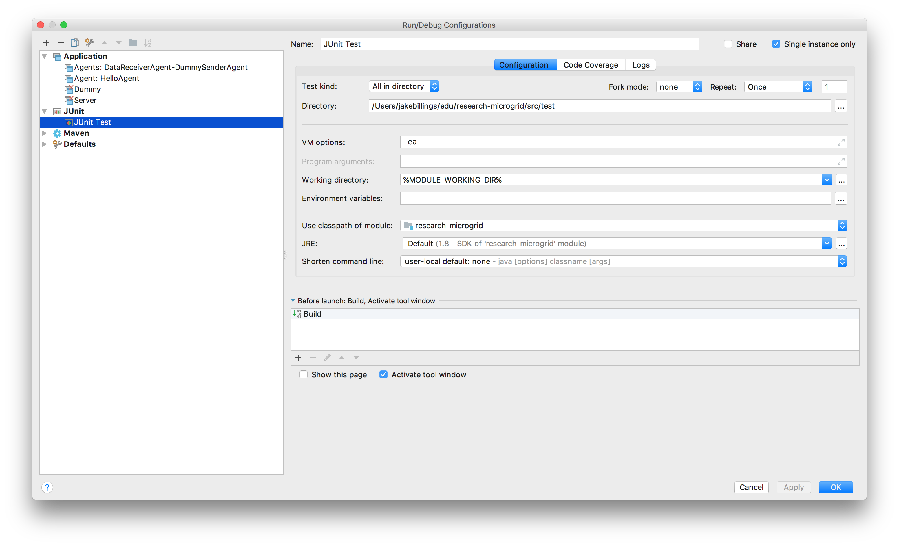

# research-microgrid

This repository contains code written for Dr. Park's microgrid research at University of Colorado Denver. The purpose is to implement a JADE agent that receives near real-time data from a distributed system of power-grid control/monitoring devices. It should store the data in SQL and send it to a GUI that maps the entire system.

I approached the problem as event-driven graph data. The power control/monitoring network is represented as a graph. The data is "pushed" to the "data agent" implemented in this repository by other agents.

Each data structure is abstracted in the "abs" package such that the code could theoretically be reused for an entirely different purpose. See `Graph` and `MicrogridGraph`.

## Architecture
### Data Flow
1. Measured by Sender Agent
2. Sent via JADE to Receiver Agent
3. Sent from Receiver Agent to Frontend Client via Socket.io

## Setup Javascript Frontend
1. `cd src/main/resources/frontend`
2. `yarn install`

## Setup JADE/Java
1. Resolve dependencies using maven (use IntelliJ to do this) `mvn install` might also work
2. Run JUnit Tests

3. Run agents:
`java jade.Boot -gui -local-port 1100 DataAgent:edu.ucdenver.park.microgrid.agents.MicrogridReceiverAgent;SenderAgent:edu.ucdenver.park.microgrid.dummy.DummyMicrogridSenderAgent`

